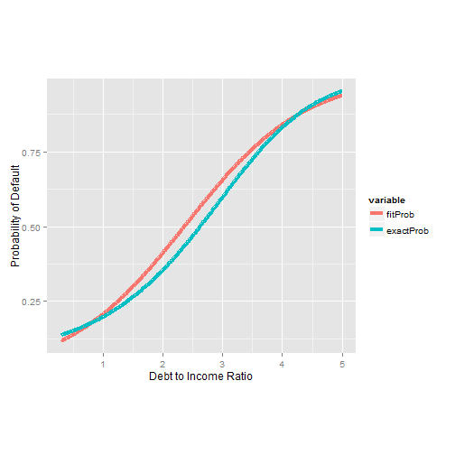

---
title       : Trainer and Simulator for Logistical Regression with GLM
subtitle    : Prototype Implementation
author      : M. L. Wenocur
job         : 
framework   : io2012        # {io2012, html5slides, shower, dzslides, ...}
highlighter : highlight.js  # {highlight.js, prettify, highlight}
hitheme     : solarized_light      # 
widgets     : [mathjax]            # {mathjax, quiz, bootstrap}
mode        : selfcontained # {standalone, draft}
knit        : slidify::knit2slides
---  bg:mistyrose
# Description of Problem

+ Understanding Linear Regression is hard. 
+ But understanding Logistic Regression is harder!
+ It is hard developing a sense of how model elements affect probabilities.
+ Harder yet understanding affect of model geometry on parameter estimation.
+ Project evolved from an attempt to understand behavior of Logistic Regression, and the inputs/outputs from R's glm method.

--- bg:mistyrose
 

# Benefits of Trainer
+ User can modify model parameters and structure.
+ Study relationship between sample size and reliability of estimates.
+ Learn about the relationship of model structure to probabilities.
+ Discover sensitivity of regression estimates to sample variability and covariate geometry.

---  bg:mistyrose

# Loan Defaulting Probability
+ Here is an example of how far estimates can differ from true values and yet match probabilities very well, as seen from the graph given below.

+ Denote the probability of defaulting by $p(x)$
 + where $p(x) = (1 + \exp(2 - 0.5x - 0.1x^2))^{-1}$,
 + $x$ is the predictor, equaling the ratio of net debt to net income, with  $0.3 \leq x \leq 5$.

+ We create a sample of loan histories by first drawing $x$ uniformly over [0.3, 5] and then generating default events with probability of $p(x)$.
 


```r
prob <- function(x) (1 + exp(2  - 0.5 * x - 0.1 * x^2)) ^ -1
set.seed(123); X <- runif(1000, 0.3, 5); X2 <- X^2
yVals <- sapply(X, function(x){rbinom(1, 1, prob(x))})
mod1 <- glm(yVals ~ X + X2, family = binomial)
cfs <- coefficients(mod1)
fmt <- 'Fitted Coefficients: %4.3f %4.3f %4.3f vs actual: -2.000 0.500 0.100'
cat(sprintf(fmt, cfs[1], cfs[2], cfs[3]))
```

```
## Fitted Coefficients: -2.306 0.955 0.010 vs actual: -2.000 0.500 0.100
```

```r
fitRho <- cfs[1] + cfs[2] * X + cfs[3] * X^2; fitProb <- (1 + exp(-fitRho))^-1
```

---  bg:mistyrose
 

```r
probCmp <- melt(data.frame(X, fitProb, exactProb = prob(X)), id = "X")
ggplot(data=probCmp, aes(x=X, y=value, color=variable)) + geom_line(size=1.5) + 
    coord_fixed(ratio = 5) + labs(x='Debt to Income Ratio', y='Probability of Default')
```

 

